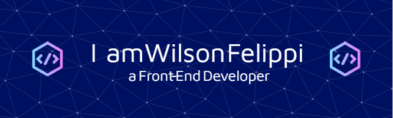

#### Currently a student of Systems Analysis and Development.

I'm a enthusiastic front-end developer commited to creating visually appealing and user-frindly websites. 
Dedicated to optimizing user experiences through thoughtful design and efficient code.

- 🔭 I’m currently working on personal projects. 
- 🌱 I’m currently learning CSS, Javascript, React and Python. 

  

    
